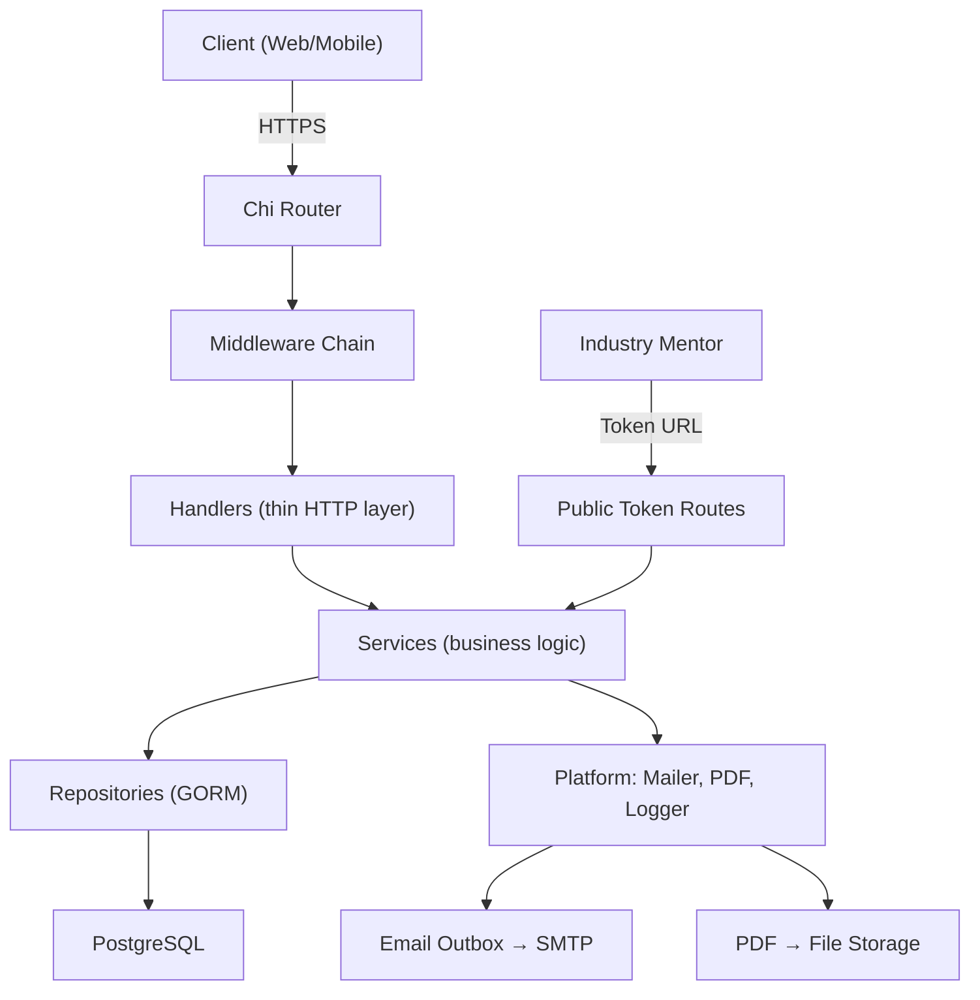

# SLI Backend Server — Implementation Plan

A production-ready Go API for managing 16-week student internship reporting, mentor feedback, evaluation scheduling, locked marks, and generated marksheet PDFs.

---

## User Review Required

> [!IMPORTANT]
> **Google OAuth Configuration**: The plan assumes `@somaiya.edu` as the allowed Google Workspace domain. Please confirm the exact domain(s) to whitelist.

> [!IMPORTANT]
> **JWT vs Server-Side Sessions**: IDEA.md mentions "session or JWT flow." This plan uses **stateless JWT** (access token + refresh token stored in HTTP-only cookies) for simplicity. If you prefer server-side sessions (e.g., Redis-backed), please indicate.

> [!WARNING]
> **Object Storage for PDFs**: IDEA.md shows "Object Storage → Marksheet PDFs." This plan starts with **local filesystem storage** behind an abstracted interface, so S3/GCS can be plugged in later. Confirm if you need S3/GCS from day one.

> [!IMPORTANT]
> **SMTP Provider**: The plan uses a configurable SMTP interface. Please confirm if you have a specific provider (SendGrid, AWS SES, Mailgun, etc.) or if raw SMTP is sufficient for now.

## Resolved Questions

1. **Edit window duration** — **24 hours** after initial submission. Configurable via `REPORT_EDIT_WINDOW_HOURS` (default: 24).

2. **Evaluation mark breakdown (total: 100)**:
   - Quality of Report: **0–20**
   - Oral Presentation: **0–30**
   - Quality of Work Done: **0–15**
   - Understanding of Work: **0–15**
   - Periodic Interaction with Mentor: **0–20**
   - Remarks: free-text

3. **Evaluation page fields**: Student Name, Roll No, Date of Examination, Venue, Internship/Project Title, then marks.

4. **One internship per student** — enforced via unique constraint on `student_id` in the `internships` table. No multiple active internships.

5. **Correction records for locked marks** — `evaluation_corrections` table stores old scores, new scores, reason, and admin identity. Never silently mutates.

6. **Rate limiting** — sensible defaults (100 req/min authenticated, 20 req/min public, 10 req/min auth), fully configurable via config file.

7. **All config in one file** — single `config.yaml` (or `.env`) loaded by `internal/config/config.go`.

8. **Industry mentor ↔ multiple students** — one industry mentor email can be associated with many internships. Feedback link emails include student name, roll no, and internship details so the mentor knows which student the link is for.

9. **Audit every change** — all mutations store timestamp + actor name (not just ID). Audit log includes `actor_name` field.

10. **Structured server logging** — All server-level events use Go `log/slog` with JSON output. This includes:
    - Server startup/shutdown (port, config summary, graceful shutdown status)
    - Database connection established/closed, migration status
    - Background worker lifecycle (outbox dispatcher started/stopped, reminder worker tick, token cleanup)
    - OAuth provider initialization
    - Per-request logging via middleware (request ID, actor ID, actor name, route, method, status code, duration, error code)
    - All logs are structured key-value pairs, never free-form `fmt.Println`.

---

## Proposed Architecture

The architecture follows the layered pattern from IDEA.md exactly:



---

## Proposed Changes

### Phase 1 — Project Foundation

Sets up Go module, configuration, logging, error handling, router, and health endpoints.

---

#### [NEW] [go.mod](file:///d:/SWDC/Backend/go.mod)
Go module `github.com/sli/backend` with dependencies: `chi/v5`, `gorm`, `gorm/postgres`, `golang-jwt/jwt/v5`, `golang.org/x/oauth2`, `crypto`, `godotenv`.

#### [NEW] [go.sum](file:///d:/SWDC/Backend/go.sum)
Auto-generated dependency lock file.

#### [NEW] [.env.example](file:///d:/SWDC/Backend/.env.example)
Template for all required environment variables with documentation comments.

#### [NEW] [cmd/server/main.go](file:///d:/SWDC/Backend/cmd/server/main.go)
Application entrypoint. Loads config, initializes DB, creates services, starts HTTP server with graceful shutdown, and launches background workers (outbox dispatcher, reminder worker, token cleanup).

#### [NEW] [internal/config/config.go](file:///d:/SWDC/Backend/internal/config/config.go)
Struct-based config loaded from environment variables. Covers: server port, DB DSN, JWT secret/expiry, OAuth client ID/secret/redirect, allowed domain, SMTP settings, PDF storage path, rate limit values, report edit window hours.

---

#### [NEW] [internal/platform/errors/errors.go](file:///d:/SWDC/Backend/internal/platform/errors/errors.go)
Typed application errors with error codes (`UNAUTHORIZED`, `FORBIDDEN`, `NOT_FOUND`, `VALIDATION_FAILED`, `REPORT_ALREADY_LOCKED`, `TOKEN_EXPIRED`, `WEEK_OUT_OF_RANGE`, etc.) mapped to HTTP status codes. Includes `request_id` in error responses.

#### [NEW] [internal/platform/errors/codes.go](file:///d:/SWDC/Backend/internal/platform/errors/codes.go)
Error code constants and HTTP status mapping table.

---

#### [NEW] [internal/platform/logger/logger.go](file:///d:/SWDC/Backend/internal/platform/logger/logger.go)
Structured JSON logger using `log/slog`. Includes request ID, actor ID, route, status code, duration, and error code fields as required by AGENTS.md.

---

#### [NEW] [internal/http/router.go](file:///d:/SWDC/Backend/internal/http/router.go)
Chi router setup with all middleware chains and route group registration. Middleware order: `RequestID → Recoverer → Logger → RateLimiter → CORS → Auth → RBAC`.

#### [NEW] [internal/http/middleware/request_id.go](file:///d:/SWDC/Backend/internal/http/middleware/request_id.go)
Generates unique request IDs (prefixed `req_`) and attaches to context.

#### [NEW] [internal/http/middleware/recoverer.go](file:///d:/SWDC/Backend/internal/http/middleware/recoverer.go)
Panic recovery middleware that logs stack trace and returns 500 JSON error.

#### [NEW] [internal/http/middleware/logger.go](file:///d:/SWDC/Backend/internal/http/middleware/logger.go)
Request/response logging middleware with duration, status code, route, actor ID.

#### [NEW] [internal/http/middleware/ratelimit.go](file:///d:/SWDC/Backend/internal/http/middleware/ratelimit.go)
In-memory token bucket rate limiter per IP. Configurable limits.

#### [NEW] [internal/http/middleware/cors.go](file:///d:/SWDC/Backend/internal/http/middleware/cors.go)
CORS configuration middleware with configurable allowed origins.

#### [NEW] [internal/http/response/json.go](file:///d:/SWDC/Backend/internal/http/response/json.go)
Helper functions: `JSON(w, status, data)`, `Error(w, err)` for consistent JSON responses.

---

#### [NEW] [internal/handlers/health_handler.go](file:///d:/SWDC/Backend/internal/handlers/health_handler.go)
`GET /healthz` (liveness) and `GET /readyz` (DB connectivity check).

---

### Phase 2 — Auth & Users

Google OAuth/OIDC login, JWT token management, user/role schema.

---

#### [NEW] [internal/platform/db/db.go](file:///d:/SWDC/Backend/internal/platform/db/db.go)
GORM database connection initialization with PostgreSQL driver, connection pool settings.

#### [NEW] [internal/platform/db/migrate.go](file:///d:/SWDC/Backend/internal/platform/db/migrate.go)
Database migration runner. Uses GORM AutoMigrate for development; structured SQL migrations for production.

---

#### [NEW] [internal/domain/user.go](file:///d:/SWDC/Backend/internal/domain/user.go)
`User` struct: `ID`, `GoogleSub`, `Email`, `Name`, `Domain`, `CreatedAt`, `UpdatedAt`. `Role` struct: `ID`, `Name`. `UserRole` join struct.

#### [NEW] [internal/domain/enums.go](file:///d:/SWDC/Backend/internal/domain/enums.go)
Role name constants: `RoleStudent`, `RoleFacultyMentor`, `RoleCoordinator`, `RoleHOD`, `RoleSuperAdmin`. Status enums for internships, assignments, outbox.

---

#### [NEW] [internal/repositories/user_repository.go](file:///d:/SWDC/Backend/internal/repositories/user_repository.go)
Interface + GORM implementation: `FindByGoogleSub`, `FindByID`, `FindByEmail`, `CreateUser`, `AssignRole`, `ListUsers`, `UpdateUser`.

---

#### [NEW] [internal/platform/auth/oauth.go](file:///d:/SWDC/Backend/internal/platform/auth/oauth.go)
Google OAuth2 configuration, OIDC token verification, domain validation (`@somaiya.edu`).

#### [NEW] [internal/platform/auth/jwt.go](file:///d:/SWDC/Backend/internal/platform/auth/jwt.go)
JWT generation (access + refresh tokens) and validation. Claims include `user_id`, `email`, `roles`, `exp`.

---

#### [NEW] [internal/http/middleware/auth.go](file:///d:/SWDC/Backend/internal/http/middleware/auth.go)
Auth middleware: extracts JWT from `Authorization: Bearer` header or HTTP-only cookie, validates, and injects user claims into `context.Context`.

#### [NEW] [internal/http/middleware/rbac.go](file:///d:/SWDC/Backend/internal/http/middleware/rbac.go)
RBAC middleware: checks user roles from context against required roles for the route. Returns 403 if unauthorized.

---

#### [NEW] [internal/services/auth_service.go](file:///d:/SWDC/Backend/internal/services/auth_service.go)
`HandleOAuthCallback`: validates Google OIDC token, checks allowed domain, upserts user, generates JWT pair (short-lived access token + longer-lived refresh token in HTTP-only cookies). `GetCurrentUser`, `RefreshToken`.

**Logout flow**:
- `Logout(ctx, userID, accessTokenJTI, refreshTokenJTI)`:
  1. Inserts both the access token JTI and refresh token JTI into the `revoked_tokens` table with their expiry times.
  2. Clears the HTTP-only `access_token` and `refresh_token` cookies (sets `MaxAge=0`).
  3. Writes an audit log entry: `action=logout`, `actor_name=<user name>`, `timestamp=now`.
  4. Logs the logout event via structured `slog`.
- Auth middleware checks every incoming JWT's `jti` against `revoked_tokens` before granting access. Revoked tokens are rejected with `401 UNAUTHORIZED`.
- A periodic cleanup job removes expired entries from `revoked_tokens` to keep the table small.

#### [NEW] [internal/domain/revoked_token.go](file:///d:/SWDC/Backend/internal/domain/revoked_token.go)
`RevokedToken` struct: `ID`, `JTI` (JWT ID, unique), `UserID`, `ExpiresAt` (copied from the token's own expiry so cleanup knows when to delete), `RevokedAt`.

#### [NEW] [internal/repositories/revoked_token_repository.go](file:///d:/SWDC/Backend/internal/repositories/revoked_token_repository.go)
Interface + GORM: `Revoke(jti, userID, expiresAt)`, `IsRevoked(jti) bool`, `CleanupExpired()`.

#### [NEW] [internal/handlers/auth_handler.go](file:///d:/SWDC/Backend/internal/handlers/auth_handler.go)
`GET /api/auth/google/login` (redirect to Google), `GET /api/auth/google/callback` (exchange code, upsert user, set JWT cookies), `POST /api/auth/logout` (revoke tokens, clear cookies, audit log), `GET /api/auth/me` (return current user profile + roles).

---

### Phase 3 — Internship Mapping

Student enrollment, coordinator faculty assignment, faculty approval.

---

#### [NEW] [internal/domain/internship.go](file:///d:/SWDC/Backend/internal/domain/internship.go)
`Internship` struct: `ID`, `StudentID`, `CompanyName`, `IndustryMentorEmail`, `StartDate`, `EndDate`, `Status`, timestamps. `MentorAssignment` struct: `ID`, `InternshipID`, `FacultyMentorID`, `ApprovedAt`, `ApprovedBy`, `Status`.

---

#### [NEW] [internal/repositories/internship_repository.go](file:///d:/SWDC/Backend/internal/repositories/internship_repository.go)
Interface + GORM implementation: `Create`, `FindByStudentID`, `FindByID`, `ListByCoordinator`, `UpdateStatus`. `MentorAssignmentRepo`: `Create`, `FindByInternshipID`, `FindByFacultyID`, `Approve`, `ListPending`.

---

#### [NEW] [internal/services/internship_service.go](file:///d:/SWDC/Backend/internal/services/internship_service.go)
`EnrollStudent` (coordinator), `AssignFacultyMentor` (coordinator), `ApproveStudent` (faculty), `GetStudentInternship`, `ListStudentsForFaculty`, `ListStudentsForCoordinator`. All with ownership checks.

---

#### [NEW] [internal/handlers/coordinator_handler.go](file:///d:/SWDC/Backend/internal/handlers/coordinator_handler.go)
Routes: `GET/POST /api/coordinator/students`, `POST /api/coordinator/students/{studentID}/assign-faculty`, `GET /api/coordinator/mentors`, `GET /api/coordinator/overview`.

#### [NEW] [internal/handlers/faculty_handler.go](file:///d:/SWDC/Backend/internal/handlers/faculty_handler.go)
Routes: `GET /api/faculty/students`, `POST /api/faculty/students/{studentID}/approve`, plus evaluation/feedback routes added in later phases.

---

### Phase 4 — Weekly Reports

16-week report model, submit/edit with edit window, faculty feedback, audit fields.

---

#### [NEW] [internal/domain/report.go](file:///d:/SWDC/Backend/internal/domain/report.go)
`WeeklyReport` struct: `ID`, `InternshipID`, `WeekNumber (1..16)`, `Content`, `SubmittedAt`, `EditedAt`, `CreatedBy`, `UpdatedBy`. `ReportFeedback` struct: `ID`, `ReportID`, `ReviewerType`, `ReviewerUserID`, `IndustryEmail`, `FeedbackText`, `SubmittedAt`, `CreatedAt`.

---

#### [NEW] [internal/repositories/report_repository.go](file:///d:/SWDC/Backend/internal/repositories/report_repository.go)
Interface + GORM: `Create`, `Update`, `FindByInternshipAndWeek`, `ListByInternship`, `FindByID`. `FeedbackRepo`: `Create`, `ListByReport`.

---

#### [NEW] [internal/services/report_service.go](file:///d:/SWDC/Backend/internal/services/report_service.go)
`SubmitReport`: validates week 1–16, active internship, no duplicate, creates report + enqueues faculty notification + generates industry token + enqueues industry email — all in one DB transaction. `EditReport`: validates edit window. `GetReports`, `GetReportByWeek`.

#### [NEW] [internal/services/feedback_service.go](file:///d:/SWDC/Backend/internal/services/feedback_service.go)
`SubmitFacultyFeedback`: validates faculty owns the student assignment. `SubmitIndustryFeedback`: validates token. `GetFeedbackForReport`.

---

#### [NEW] [internal/handlers/student_handler.go](file:///d:/SWDC/Backend/internal/handlers/student_handler.go)
Routes: `GET /api/student/dashboard`, `GET /api/student/internship`, `GET /api/student/reports`, `POST /api/student/reports/week/{week}`, `PUT /api/student/reports/week/{week}`, `GET /api/student/feedback`, `GET /api/student/evaluations`, `GET /api/student/marksheet`.

---

### Phase 5 — Industry Mentor Links

Secure token generation, hashed storage, 24-hour expiry, public report view/feedback.

---

#### [NEW] [internal/domain/token.go](file:///d:/SWDC/Backend/internal/domain/token.go)
`IndustryAccessToken` struct: `ID`, `ReportID`, `TokenHash`, `ExpiresAt`, `UsedAt`, `CreatedAt`.

---

#### [NEW] [internal/repositories/token_repository.go](file:///d:/SWDC/Backend/internal/repositories/token_repository.go)
`Create`, `FindByHash`, `MarkUsed`, `DeleteExpired`.

---

#### [NEW] [internal/services/token_service.go](file:///d:/SWDC/Backend/internal/services/token_service.go)
`GenerateToken`: creates crypto-random token, stores SHA-256 hash, sets 24h expiry. `ValidateToken`: checks hash, expiry, used flag. `CleanupExpired`.

---

#### [NEW] [internal/handlers/industry_handler.go](file:///d:/SWDC/Backend/internal/handlers/industry_handler.go)
Public routes (no auth middleware): `GET /industry/reports/{token}` (view report), `POST /industry/reports/{token}/feedback` (submit feedback).

---

### Phase 6 — Notifications

Email outbox pattern with retry, reminder worker, notification worker.

---

#### [NEW] [internal/domain/outbox.go](file:///d:/SWDC/Backend/internal/domain/outbox.go)
`EmailOutbox` struct: `ID`, `Recipient`, `Subject`, `Body`, `Status`, `Attempts`, `NextAttemptAt`.

---

#### [NEW] [internal/repositories/outbox_repository.go](file:///d:/SWDC/Backend/internal/repositories/outbox_repository.go)
`Enqueue`, `FetchPending`, `MarkSent`, `MarkFailed`, `IncrementAttempt`.

---

#### [NEW] [internal/platform/mailer/mailer.go](file:///d:/SWDC/Backend/internal/platform/mailer/mailer.go)
SMTP mailer interface + implementation. Sends HTML emails.

---

#### [NEW] [internal/services/notification_service.go](file:///d:/SWDC/Backend/internal/services/notification_service.go)
`NotifyFacultyReportSubmitted`, `NotifyIndustryMentorReviewLink`, `NotifyStudentEvaluationScheduled`, `NotifyStudentWeeklyReminder`. Each enqueues into outbox.

---

#### [NEW] [internal/jobs/outbox_dispatcher.go](file:///d:/SWDC/Backend/internal/jobs/outbox_dispatcher.go)
Background goroutine that polls outbox table, sends via mailer, handles retries with exponential backoff (max 5 attempts).

#### [NEW] [internal/jobs/reminder_worker.go](file:///d:/SWDC/Backend/internal/jobs/reminder_worker.go)
Weekly cron-like worker that finds students with missing reports for the current week and enqueues reminder emails.

#### [NEW] [internal/jobs/token_cleanup_worker.go](file:///d:/SWDC/Backend/internal/jobs/token_cleanup_worker.go)
Periodic cleanup of expired industry access tokens.

---

### Phase 7 — Evaluation & Marksheet

Evaluation scheduling, locked marks, audit log, PDF generation.

---

#### [NEW] [internal/domain/evaluation.go](file:///d:/SWDC/Backend/internal/domain/evaluation.go)
`EvaluationSchedule`: `ID`, `InternshipID`, `InSemesterAt`, `EndSemesterAt`, `Venue`, `SetBy`, `CreatedAt`. `EvaluationScore`: `ID`, `InternshipID`, `ReportQuality (0-20)`, `OralPresentation (0-30)`, `WorkQuality (0-15)`, `Understanding (0-15)`, `PeriodicInteraction (0-20)`, `Remarks`, `LockedAt`, `SubmittedBy`, `SubmittedAt`. `EvaluationCorrection`: `ID`, `EvaluationScoreID`, `OldScoresJSON`, `NewScoresJSON`, `Reason`, `CorrectedBy`, `CorrectedAt`.

#### [NEW] [internal/domain/marksheet.go](file:///d:/SWDC/Backend/internal/domain/marksheet.go)
`Marksheet`: `ID`, `EvaluationScoreID`, `FileKey`, `GeneratedAt`, `GeneratedBy`.

#### [NEW] [internal/domain/audit.go](file:///d:/SWDC/Backend/internal/domain/audit.go)
`AuditLog`: `ID`, `ActorUserID`, `Action`, `ResourceType`, `ResourceID`, `MetadataJSON`, `CreatedAt`.

---

#### [NEW] [internal/repositories/evaluation_repository.go](file:///d:/SWDC/Backend/internal/repositories/evaluation_repository.go)
Schedule CRUD, score create/find, correction create.

#### [NEW] [internal/repositories/audit_repository.go](file:///d:/SWDC/Backend/internal/repositories/audit_repository.go)
`Create`, `ListByResource`, `ListByActor`, `ListAll` (paginated).

#### [NEW] [internal/repositories/marksheet_repository.go](file:///d:/SWDC/Backend/internal/repositories/marksheet_repository.go)
`Create`, `FindByEvaluationScoreID`, `FindByInternshipID`.

---

#### [NEW] [internal/services/evaluation_service.go](file:///d:/SWDC/Backend/internal/services/evaluation_service.go)
`SetSchedule` (faculty), `SubmitMarks` (faculty — transaction: insert scores, lock, audit log, enqueue PDF), `GetEvaluationForStudent`, `CorrectMarks` (super admin — audited correction record).

#### [NEW] [internal/services/marksheet_service.go](file:///d:/SWDC/Backend/internal/services/marksheet_service.go)
`GenerateMarksheet` (PDF generation), `DownloadMarksheet` (serve file with ownership check).

---

#### [NEW] [internal/platform/pdf/generator.go](file:///d:/SWDC/Backend/internal/platform/pdf/generator.go)
PDF generation using `go-pdf/fpdf`. Creates formatted marksheet with student info, scores, faculty details, college branding.

#### [NEW] [internal/platform/storage/storage.go](file:///d:/SWDC/Backend/internal/platform/storage/storage.go)
File storage interface (`Save`, `Get`, `Delete`) with local filesystem implementation. Abstracts away S3/GCS for future.

---

Faculty handler additions (evaluation routes):
- `POST /api/faculty/students/{studentID}/evaluations/schedule`
- `POST /api/faculty/students/{studentID}/evaluations`
- `GET /api/faculty/students/{studentID}/marksheet`

---

### Phase 8 — Dashboards & Admin

Coordinator overview, HOD statistics, Super Admin repair tools, audit log viewer.

---

#### [NEW] [internal/handlers/hod_handler.go](file:///d:/SWDC/Backend/internal/handlers/hod_handler.go)
Routes: `GET /api/hod/stats`, `GET /api/hod/reports/completion`, `GET /api/hod/evaluations/progress`, `GET /api/hod/mentors/load`.

#### [NEW] [internal/handlers/admin_handler.go](file:///d:/SWDC/Backend/internal/handlers/admin_handler.go)
Routes: `GET /api/admin/users`, `POST /api/admin/users/{userID}/roles`, `POST /api/admin/internships/{internshipID}/repair`, `GET /api/admin/audit-logs`.

---

#### [NEW] [internal/services/stats_service.go](file:///d:/SWDC/Backend/internal/services/stats_service.go)
Aggregation queries for coordinator overview and HOD dashboard: submission completion %, pending reviews count, mentor load distribution, evaluation progress.

#### [NEW] [internal/services/admin_service.go](file:///d:/SWDC/Backend/internal/services/admin_service.go)
`AssignRole`, `RepairInternship`, `CorrectEvaluationMarks` — all write audit logs for every mutation.

---

### Phase 9 — Production Hardening

Testing, Docker, deployment, observability.

---

#### [NEW] [Dockerfile](file:///d:/SWDC/Backend/Dockerfile)
Multi-stage build: Go build stage → minimal `alpine` runtime with non-root user.

#### [NEW] [docker-compose.yml](file:///d:/SWDC/Backend/docker-compose.yml)
Local dev: Go app + PostgreSQL + optional MailHog for email testing.

#### [NEW] [Makefile](file:///d:/SWDC/Backend/Makefile)
Targets: `build`, `run`, `test`, `lint`, `migrate`, `docker-build`, `docker-up`.

---

#### [NEW] [internal/services/auth_service_test.go](file:///d:/SWDC/Backend/internal/services/auth_service_test.go)
Unit tests for auth flow, domain validation, JWT generation.

#### [NEW] [internal/services/report_service_test.go](file:///d:/SWDC/Backend/internal/services/report_service_test.go)
Unit tests for submit/edit validation, week range, edit window, ownership.

#### [NEW] [internal/services/evaluation_service_test.go](file:///d:/SWDC/Backend/internal/services/evaluation_service_test.go)
Unit tests for mark submission, locking, correction records.

#### [NEW] [internal/services/token_service_test.go](file:///d:/SWDC/Backend/internal/services/token_service_test.go)
Unit tests for token generation, validation, expiry, hash check.

#### [NEW] [internal/http/middleware/auth_test.go](file:///d:/SWDC/Backend/internal/http/middleware/auth_test.go)
Tests for JWT extraction, validation, expired tokens, missing tokens.

#### [NEW] [internal/http/middleware/rbac_test.go](file:///d:/SWDC/Backend/internal/http/middleware/rbac_test.go)
Tests for role checks, forbidden access.

#### [NEW] [internal/handlers/student_handler_test.go](file:///d:/SWDC/Backend/internal/handlers/student_handler_test.go)
Integration tests for student endpoints with mocked services.

#### [NEW] [internal/handlers/faculty_handler_test.go](file:///d:/SWDC/Backend/internal/handlers/faculty_handler_test.go)
Integration tests for faculty endpoints.

---

## Database Schema Summary

All tables use UUID primary keys, `created_at`/`updated_at` timestamps, and appropriate foreign keys with indexes.

| Table | Purpose | Key Constraints |
|---|---|---|
| `users` | All platform users | Unique `google_sub`, unique `email` |
| `roles` | Role definitions | Unique `name` |
| `user_roles` | User ↔ Role join | Composite unique `(user_id, role_id)` |
| `internships` | Student internships | FK → `users`, **unique `student_id`** (one per student) |
| `mentor_assignments` | Faculty ↔ internship | FK → `internships`, FK → `users` |
| `weekly_reports` | 16-week reports | FK → `internships`, unique `(internship_id, week_number)`, week 1–16 check, `content` is text |
| `report_feedback` | Faculty/industry feedback | FK → `weekly_reports` |
| `industry_access_tokens` | 24h review tokens | FK → `weekly_reports`, hashed token |
| `evaluation_schedules` | Evaluation dates | FK → `internships` |
| `evaluation_scores` | Locked marks (total 100) | FK → `internships`, immutable after lock, individual field max enforced |
| `evaluation_corrections` | Admin corrections | FK → `evaluation_scores`, audit trail |
| `marksheets` | Generated PDFs | FK → `evaluation_scores` |
| `email_outbox` | Reliable email queue | Status + retry logic |
| `audit_logs` | Audit trail | Actor ID, **actor name**, action, resource, metadata, timestamp |

---

## Key Design Decisions

1. **Layered architecture** — Handlers → Services → Repositories. No business logic in handlers, no HTTP concerns in services, no raw SQL outside repositories.

2. **Repository interfaces** — All repositories are defined as Go interfaces, making services testable with mock implementations.

3. **Transactional boundaries** — Report submission, evaluation locking, and admin corrections use explicit DB transactions wrapping multiple repository calls.

4. **Outbox pattern for emails** — Emails are never sent synchronously during request handling. They're enqueued into `email_outbox` within the same transaction and dispatched asynchronously.

5. **Token security** — Industry mentor tokens use `crypto/rand` for generation and `SHA-256` hashing for storage. Only the hash is persisted; the raw token is sent via email and never stored.

6. **Immutable evaluations** — Once `locked_at` is set on `evaluation_scores`, no normal flow can modify it. Super Admin corrections create a new `evaluation_corrections` row preserving the audit trail.

7. **Context propagation** — `context.Context` flows through every layer for cancellation, timeouts, and request-scoped values (user claims, request ID).

---

## Verification Plan

### Automated Tests
```bash
# Unit tests for all services, middleware, and handlers
go test ./... -v -cover

# Run tests with race detector
go test ./... -race

# Integration tests (requires PostgreSQL)
go test ./internal/repositories/... -tags=integration -v
```

### Build Verification
```bash
# Ensure project compiles cleanly
go build ./...

# Lint with golangci-lint
golangci-lint run ./...

# Vet for common issues
go vet ./...
```

### Manual Verification
- OAuth login flow via browser with `@somaiya.edu` account
- Submit/edit weekly report and verify audit fields
- Generate industry mentor token and test 24h expiry
- Submit faculty evaluation, verify lock, attempt edit (should fail)
- Super Admin correction flow and audit log verification
- PDF marksheet generation and download
- Email outbox processing with MailHog
- Health/readiness endpoints

### Requirements Checklist (vs IDEA.md)

| Requirement | Status |
|---|---|
| Go + Chi + GORM + PostgreSQL | ✅ Planned |
| Google OAuth/OIDC with domain check | ✅ Planned |
| 6 roles with RBAC | ✅ Planned |
| 16-week report submit/edit | ✅ Planned |
| Edit window enforcement | ✅ Planned |
| `submitted_at`, `edited_at`, `created_by`, `updated_by` audit fields | ✅ Planned |
| Faculty feedback on reports | ✅ Planned |
| Industry mentor 24h secure token link | ✅ Planned |
| Evaluation scheduling (in-semester + end-semester) | ✅ Planned |
| Locked evaluation marks | ✅ Planned |
| Audited corrections (not silent updates) | ✅ Planned |
| Marksheet PDF generation | ✅ Planned |
| Email outbox with retries | ✅ Planned |
| Reminder worker | ✅ Planned |
| Coordinator overview | ✅ Planned |
| HOD statistics | ✅ Planned |
| Super Admin repair tools | ✅ Planned |
| Audit log for sensitive writes | ✅ Planned |
| Consistent JSON error responses | ✅ Planned |
| Structured logging with request ID | ✅ Planned |
| Health + readiness endpoints | ✅ Planned |
| CORS + rate limiting | ✅ Planned |
| Docker deployment | ✅ Planned |
| Unit + integration tests | ✅ Planned |

### AGENTS.md Invariants Checklist

| Invariant | Implementation |
|---|---|
| All protected routes pass auth + RBAC middleware | Chi middleware chain on all `/api/*` groups |
| Resource ownership on server | Service layer validates ownership before any operation |
| Reports scoped by `student_id`, `internship_id`, `week_number` | Unique composite constraint + service validation |
| Week 1–16 constraint | DB check constraint + service validation |
| Hashed tokens, 24h expiry, single-scope | SHA-256 hash, `expires_at` column, FK to single report |
| Evaluation immutability after lock | `locked_at` guard in service + DB constraint |
| Corrections as audited records | `evaluation_corrections` table |
| Email outbox with retries | `email_outbox` table + dispatcher worker |
| Actor identity + timestamp on writes | `created_by`, `updated_by`, `submitted_by`, timestamps |
| Logs: request ID, actor ID, route, status, duration, error | Structured `slog` logger middleware |
